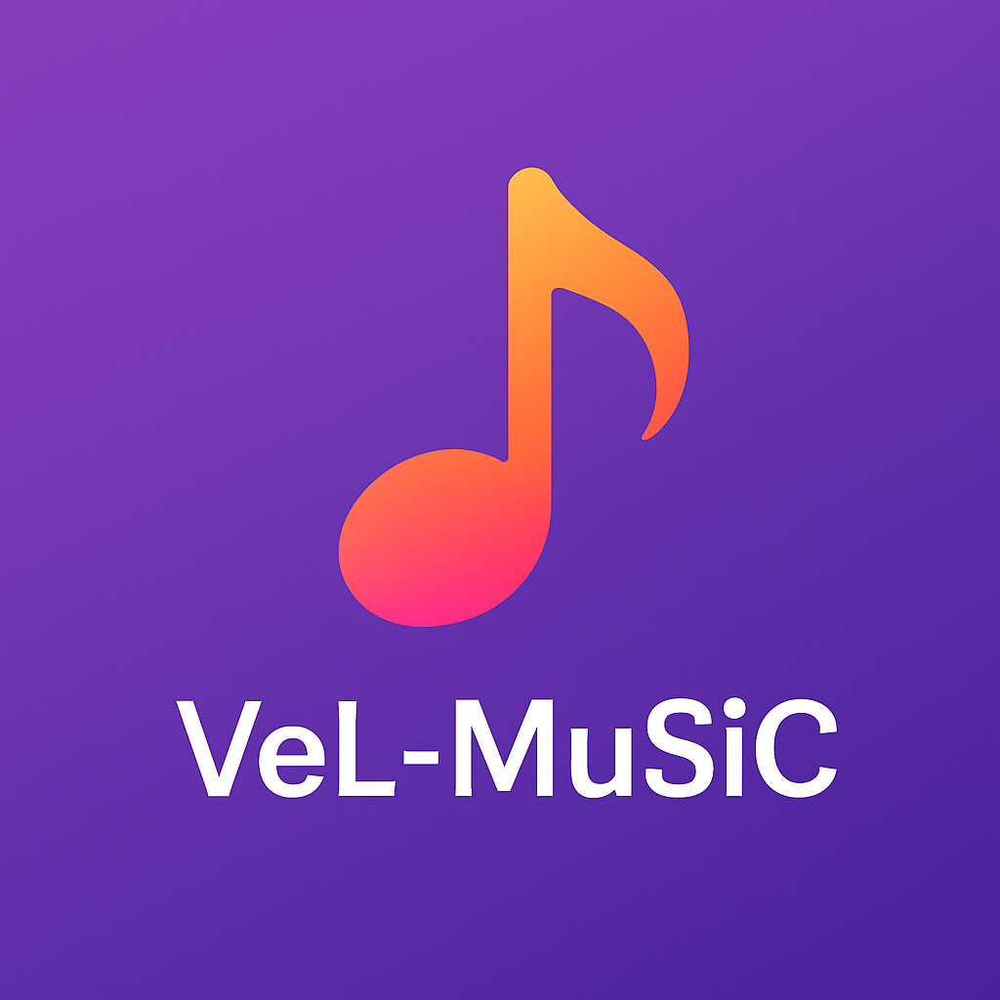
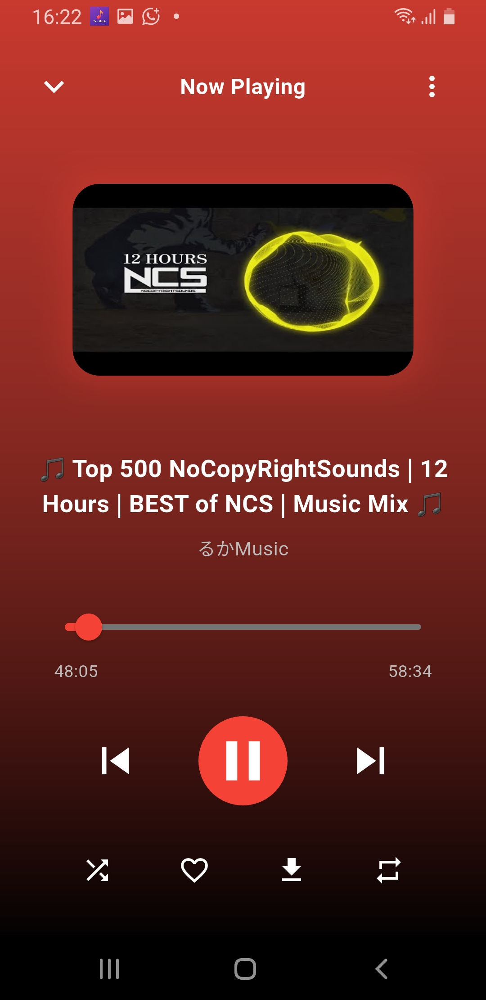
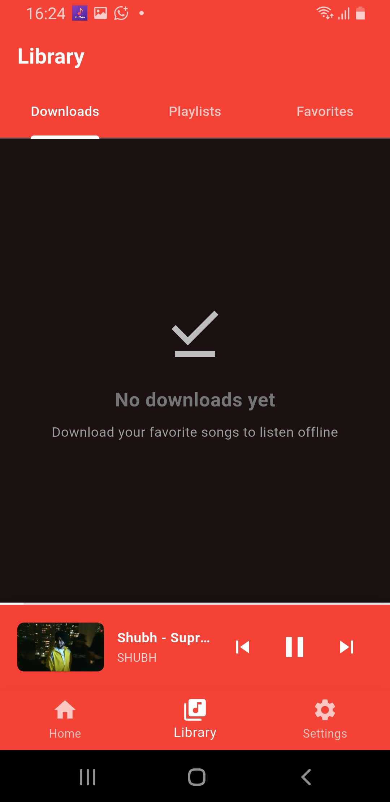
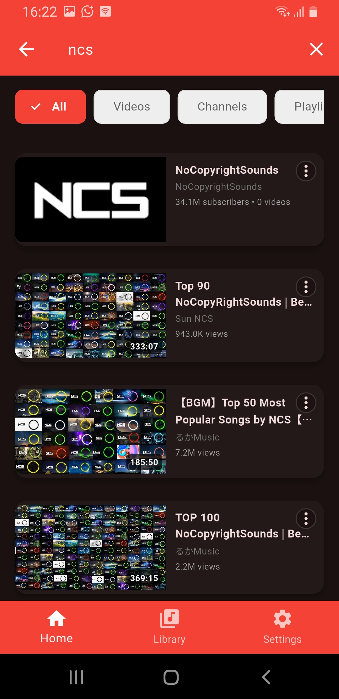

# 🎵 VeL-MuSiC

<div align="center">



**A Beautiful & Feature-Rich YouTube Music Client Built with Flutter**

[](https://flutter.dev/)
[](https://dart.dev/)
[](LICENSE)
[](https://flutter.dev/)

</div>

---

## ✨ Features

### 🎧 **Music Streaming**
- **High-Quality Audio**: Stream music in various quality options
- **Background Playback**: Continue listening while using other apps
- **Offline Support**: Download tracks for offline listening
- **Smart Queue Management**: Create and manage playlists

### 🎨 **Beautiful UI/UX**
- **Material Design 3**: Modern, intuitive interface
- **Dynamic Themes**: Light/Dark mode with custom color schemes
- **Responsive Layout**: Optimized for all screen sizes
- **Smooth Animations**: Fluid transitions and micro-interactions

### 🔍 **Advanced Search & Discovery**
- **YouTube Music Integration**: Access to vast music library
- **Piped API**: Privacy-focused backend
- **Smart Recommendations**: Discover new music based on preferences
- **Channel Browsing**: Explore artists and content creators

### 📱 **Cross-Platform**
- **Android**: Full native experience
- **iOS**: Optimized for Apple devices
- **Web**: Access from any browser
- **Desktop**: Windows, macOS, and Linux support

### 🎯 **Premium Features**
- **Audio Controls**: Play, pause, skip, shuffle, repeat
- **Progress Tracking**: Visual progress bars and time display
- **Library Management**: Organize your music collection
- **Download Manager**: Batch download with progress tracking

---

## 🚀 Getting Started

### Prerequisites
- [Flutter](https://flutter.dev/docs/get-started/install) 3.8.1 or higher
- [Dart](https://dart.dev/get-dart) 3.0 or higher
- Android Studio / Xcode (for mobile development)
- VS Code (recommended editor)

### Installation

1. **Clone the repository**
   ```bash
   git clone https://github.com/yourusername/vel-music.git
   cd vel-music
   ```

2. **Install dependencies**
   ```bash
   flutter pub get
   ```

3. **Run the app**
   ```bash
   flutter run
   ```

### Building for Production

**Android APK:**
```bash
flutter build apk --release
```

**iOS IPA:**
```bash
flutter build ios --release
```

**Web:**
```bash
flutter build web --release
```

---

## 🏗️ Architecture

### **Project Structure**
```
lib/
├── models/          # Data models
├── providers/       # State management
├── screens/         # UI screens
├── services/        # Business logic
├── widgets/         # Reusable components
└── main.dart        # App entry point
```

### **Key Technologies**
- **Flutter**: Cross-platform UI framework
- **Provider**: State management solution
- **Just Audio**: Audio playback engine
- **Piped API**: YouTube Music backend
- **HTTP**: Network requests
- **Shared Preferences**: Local storage

### **State Management**
- **Provider Pattern**: Clean separation of concerns
- **Reactive UI**: Automatic UI updates
- **Persistent State**: Settings and preferences saved locally

---

## 🎨 Screenshots

<div align="center">

| Home Screen | Player | Library | Search |
|-------------|---------|---------|---------|
|  |  |  |  |

</div>

---

## 🔧 Configuration

### **Environment Setup**
1. Configure your development environment
2. Set up Android/iOS development tools
3. Configure signing keys for production builds

### **API Configuration**
- **Piped API**: Default backend (no API key required)
- **Custom Backend**: Configure your own Piped instance

### **Permissions**
- **Storage**: For downloading music
- **Audio**: For background playback
- **Internet**: For streaming music

---

## 📱 Supported Platforms

| Platform | Version | Status |
|----------|---------|---------|
| Android | 5.0+ (API 21+) | ✅ Fully Tested & Supported |
| iOS | 12.0+ | ⚠️ Not Tested |
| Web | Modern Browsers | ⚠️ Not Tested |
| Windows | 10+ | ⚠️ Not Tested |
| macOS | 10.14+ | ⚠️ Not Tested |
| Linux | Ubuntu 18.04+ | ⚠️ Not Tested |

> **Note**: This app has been thoroughly tested on Android devices. Other platforms may work but haven't been tested yet.

---

## 🤝 Contributing

We welcome contributions! Here's how you can help:

### **Development Setup**
1. Fork the repository
2. Create a feature branch: `git checkout -b feature/amazing-feature`
3. Make your changes
4. Run tests: `flutter test`
5. Commit: `git commit -m 'Add amazing feature'`
6. Push: `git push origin feature/amazing-feature`
7. Open a Pull Request

### **Code Style**
- Follow Flutter/Dart conventions
- Use meaningful variable names
- Add comments for complex logic
- Write unit tests for new features

### **Issues & Bug Reports**
- Use the GitHub issue tracker
- Provide detailed reproduction steps
- Include device/OS information
- Attach relevant logs

---

## 📄 License

This project is licensed under the **MIT License** - see the [LICENSE](LICENSE) file for details.

---

## 🙏 Acknowledgments

- **Flutter Team**: For the amazing framework
- **Piped Project**: For the privacy-focused API
- **Just Audio**: For the robust audio engine
- **Contributors**: Everyone who helped build this app

---

## 📞 Support

- **GitHub Issues**: [Report bugs & request features](https://github.com/yourusername/vel-music/issues)
- **Discussions**: [Join the community](https://github.com/yourusername/vel-music/discussions)
- **Contact**: Reach out to Shashwat for support and feedback

---

<div align="center">

**Made with ❤️ by Shashwat**

[](https://github.com/yourusername/vel-music)
[](https://github.com/yourusername/vel-music)
[](https://github.com/yourusername/vel-music/issues)

</div>
